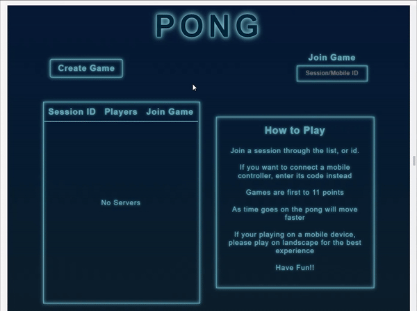
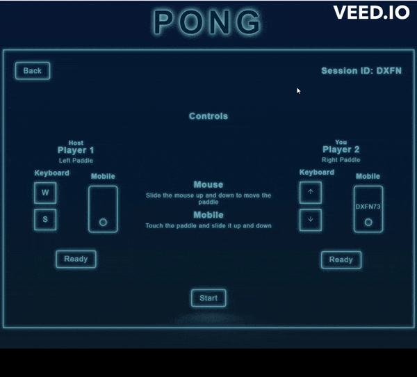
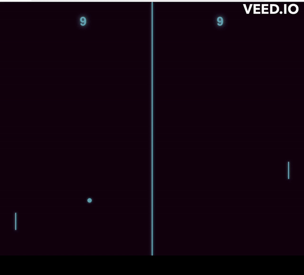

# [Synth-Pong](https://synth-pong.netlify.app)
## Tech Stack
<p>


</p>
<p>


</p>

## Table of Contents
- [Project Overview](#project-overview)
- [Installation & Setup](#installation--setup)
- [Components](#components)


## Project Overview
A neon retro themed multiplayer Pong game. I was really intrigued of the idea of making a multiplayer game on the browser and decided to give it a try.
I went with Pong because it is historic as some say it was the first game made, and this was my first attempt at a game. I was able to succesfully create a multiplayer game, where players are able to host, and join games. The communication between seperate players is all accomplished through websockets. This was also my first project with TypesScript and using Vite to scaffold my react app. 

## Installation & Setup

### Cloning the repo
```
$ git clone https://github.com/moses369/Synth-Pong.git
$ cd Synth-Pong/
```
### Frontend setup
In the first terminal
```
$ cd client/
$ npm i
$ npm run dev
```
### Backend Setup
Open a new terminal and run the following commands
```
$ cd server/
$ npm i
$ npm run dev
```
### Open in browser
Open http://localhost:5173/

## Components
- [Main Menu](#main-menu)
- [Lobby](#lobby)
- [Game](#game)

### Main Menu 

>  - The server list will update live, when players host, join, leave sessions.
>  - Players can join sessions by clicking join in the session list, or by typing it's id in the search bar
>  - Players can connect their mobile phones as a controller, by entering the mobile code in the search bar

### Lobby 

> - Host's are notified when a player joins, and leaves through the 'Joined' indicator above Player 2 
> - Host are not able to star the game until both players ready up
> - Host can switch the game from online to local, to allow local co-op
> - Players are notified and sent back to the menu whenever the host disconnects, or switches the lobby to local

### Game

> - First to 11 wins
> - At the end of the round players are presented with the options to play again, go back to the lobby, or exit to the menu
> > - If players want to play again and are playing online both players have to click play again
> - Controls
> > - In online play, players can use their mouse to control their paddle
> > - Players can always use there keyboard controls
> > - On mobile they can drag their paddle up and down by touching and sliding it with their finger, the same goes for the mobile controller


